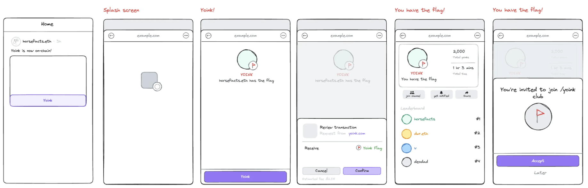
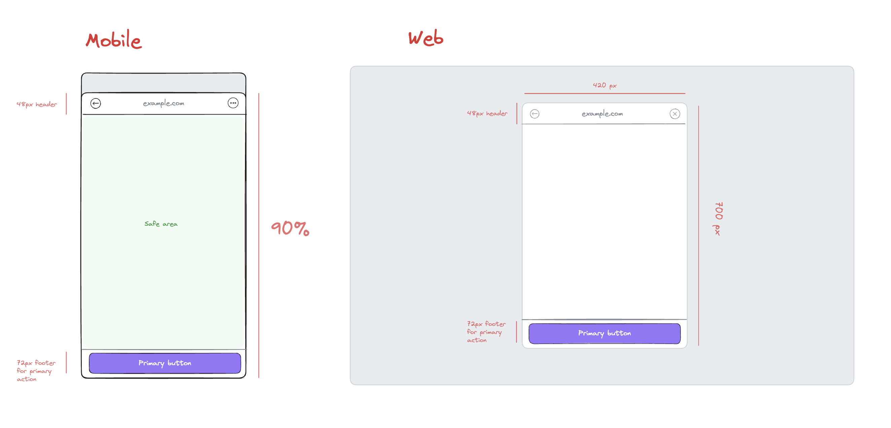
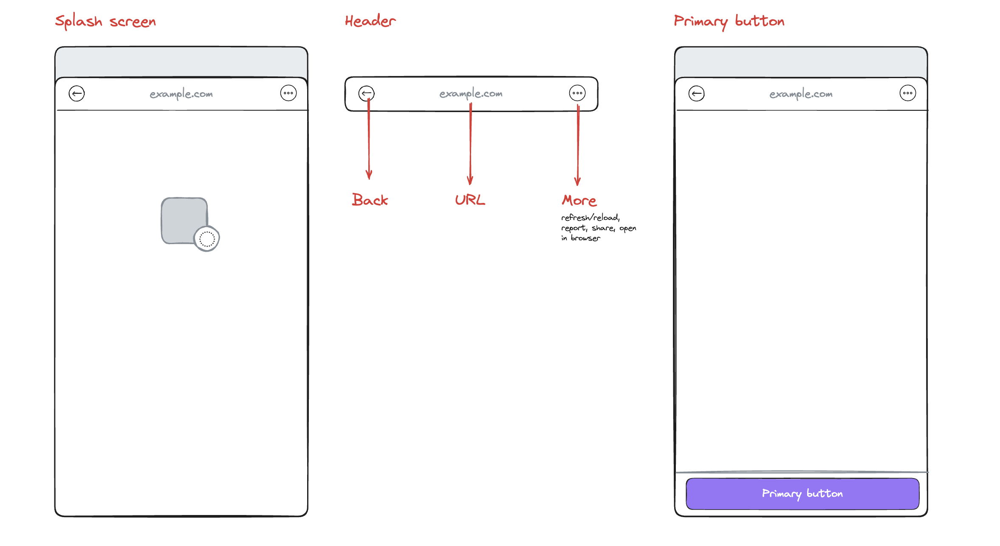

An App Frame should be the fastest way to develop and distribute social applications:

- distribute your app in feeds and hooks (i.e. cast action, explore) of any Farcaster client
- use identity to provide social context and allow authenticated actions
- prompt the user to Farcaster actions like sending a cast or joining a channel
- interact with a user’s Ethereum wallet using familiar tools like [wagmi](https://wagmi.sh/)

App Frames are the successor to Mini Apps with the following key changes:

- **better performance** — App Frames are opened directly without requiring a POST first
- **expanded API** — expanded functionality, built-in UI elements, and wallet exposed via an Ethereum Provider
- **permissionless** — no more allowlisting of domains for use in Warpcast



# Spec \[Draft\]

:::warning Unreleased
This is a Work-in-Progress and subject to change. Please provide your feedback by direct casting [@deodad](https://warpcast.com/deodad) or posting in /fc-devs and tagging @deodad.
:::

## User Interface

An App Frame should be rendered in a vertically oriented modal element.





### Header

A Header must be rendered above the App Frame that displays the domain of the App Frame being viewed and a back / close button.

### Splash Screen

A Splash Screen must be immediately shown when a user launches an App Frame using the image and background color specified by the App Frame developer. The App Frame can hide the Splash Screen once it is loaded and initialized.

### Primary Button

An App Frame will be able to programmatically set and update a Primary Button that will be presented to the user in the footer below the App Frame. An App Frame can use this button to create a clear and consistent call-to-action for the user.

## Launching an App Frame

An configuration object defines how to launch an App Frame.

```tsx
type AppFrameConfig = {
  /** URL that hosts the App Frame */
  url: string;
  /** Image to show on the Splash Screen */
  splashImageUrl: string;
  /** Background color to show on the Splash Screen */
  splashBackgroundColor: string;
};
```

To launch an App Frame, `url` is opened in an embedded web view. A Splash Screen is rendered with `splashBackgroundColor` as the background color and `splashImageUrl` as a background image. The App Frame will call `hideSplashScreen` once it is ready to be presented to a user.

## API

App Frames would have the following API provided by the Farcaster client hosting the App Frame.

### untrustedUser

Information about the interacting user.

```tsx
type UntrustedUser = {
  fid: number;
  username?: string;
  displayName?: string;
  pfpUrl?: string;
};
```

This data can be used to customize the interface, however, you should not trust this data for taking privileged actions as this user. Instead, use the `requestAuthToken` endpoint to get an authenticated token that can be verified by your backend.

### launchContext

Context on how the AppFrame was launched.

```tsx
type CastFrameEmbedLaunchContext = {
  type: 'cast_frame_embed';
  castHash: string;
};

type DirectCastFrameEmbedLaunchContext = {
  type: 'direct_cast_frame_embed';
};

type CastActionLaunchContext = {
  type: 'cast_action';
  castHash: string;
};

type ComposerActionLaunchContext = {
  type: 'composer_action';
  cast: {
    parent?: string; // Cast parent hash
    text?: string; // Cast text, can include @mentions
    embeds?: string[]; // Embed URLs
  };
};

type ChannelProfileLaunchContext = {
  type: 'channel_profile';
  channelKey: string;
};

type LaunchContext =
  | CastFrameEmbedLaunchContext
  | DirectCastFrameEmbedLaunchContext
  | CastActionLaunchContext
  | ComposerActionLaunchContext
  | ChannelProfileLaunchContext;
```

### setPrimaryButton

Set the Primary Button.

```tsx
type SetPrimaryButton = (
	options: {
	  text: string;
	  enabled?: boolean;
	  hidden?: boolean;
	},
	callback: () => Promise<void>;
) => Promise<void>;
```

### close

Closes the App Frame and optionally show a toast.

```tsx
type Close = (options: {
  toast?: {
    message: string;
  };
}) => Promise<void>;
```

### hideSplashScreen

Hides the Splash Screen. This should be called after the App Frame is initialized and ready to be presented to the user.

```tsx
type HideSplashScreen: () => Promise<void>;
```

### ethereumProvider

An [EIP-1193 Ethereum Provider](https://eips.ethereum.org/EIPS/eip-1193) for interacting with the user’s connected wallet. App Frames can interact with this provider using familiar tools like [wagmi](https://wagmi.sh/) to:

- get the user’s connected Ethereum address
- request a transaction or signature
- and anything else supported by Ethereum RPC

### requestAuthToken

Request a JSON Farcaster Token that can be used to make authenticated requests to server.

```tsx
type RequestAuthToken = (
  options: Partial<{
    /**
     * When this token should be considered invalid.
     * @default 15 minutes from now
     */
    exp?: number;
  }>
) => string;
```

See the JSON Farcaster Token for full details.

**Note on authentication**

The token is signed by an App Key—this means any application the user has granted a key to via the Connect to Farcaster flow can make authenticated requests on the user’s behalf.

For many applications this is sufficient, but note that this is different and weaker than Sign In with Farcaster; a second form of authentication should be used before giving acess to sensitive information or a significant funds.

### openExternalUrl

Opens a URL in a web browser.

```tsx
type OpenExternalUrl = (options: { url: string }) => Promise<void>;
```

### openFarcasterUri

Close the App Frame and navigate to a Farcaster resource (i.e. cast, profile, channel)/

```tsx
type OpenExternalUrl = (options: { url: string }) => Promise<void>;
```

### openCastComposer

Closes the App Frame and opens the cast composer.

```tsx

type OpenCastComposer = (
	options: {
		text?: string;
		embeds?: string[];
		channelKey? string;
		parentCastHash?: string;
	}
) => Promise<void>;
```

### followChannel

Prompt the user to follow a channel:

```tsx
type FollowChannel = (options: { channelKey: string }) => Promise<void>;
```
