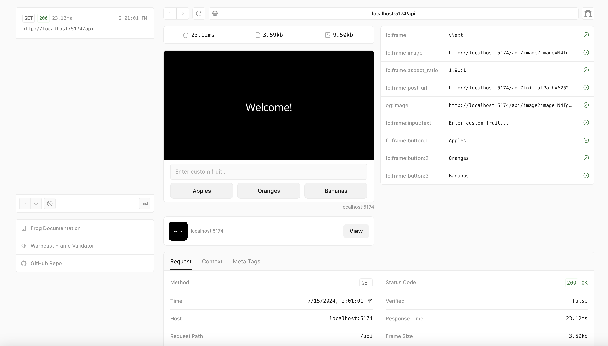

# Getting Started

::: info Not ready to build?
If you'd prefer to learn more about Frames before building one, jump ahead to the [Frames Specification](./spec).
:::

Let's use Frog to go from 0 to 1 in less than a minute. At the end of this we'll have:

- a type-safe frame server with a basic frame
- a tool for interacting with and debugging our Frame locally
- our server deployed on the public internet

### Bootstrap via CLI

To get started, scaffold a new project:

::: code-group

```ts [npm]
npm init frog -t vercel
```

```ts [yarn]
yarn create frog -t vercel
```

```ts [bun]
bunx create-frog -t vercel
```

```ts [pnpm]
pnpm create frog -t vercel
```

Complete the prompts and follow the instructions:

```
bun install // install dependencies
bun run dev // start dev server
```

::: info
This guide uses Frog + Vercel but frames can be built and deployed in any
number of ways. You can check out popular alternatives like [frame.js](https://framesjs.org/)
on the [Frame Developer Resources](./resources) page.
:::

### Open the preview

Now that you have a frame server running, navigate to
`http://localhost:5174/api/dev` to interact with your frame in the
[Devtools](https://frog.fm/concepts/devtools) preview.

You should see a frame that says "Welcome!" and has three buttons: apples,
oranges, and bananas. Click on any of the buttons and the frame will update
with a message echoing your choice.



### Deploy the frame

::: info
This project was scaffolded for deployment with Vercel since it's a popular and
easy option. If you'd like to deploy your Frame another way check out the [Frog
Platforms documentation](https://frog.fm/platforms/bun).
:::

To distribute your frame your server will need to be hosted somewhere on the
internet. Feel free to skip this step and come back later.

::: code-group

```ts [npm]
npm run deploy
```

```ts [yarn]
yarn run deploy
```

.

```ts [bun]
bunx run deploy
```

```ts [pnpm]
pnpm run deploy
```

Complete the prompts. Once your frame is deployed you can test it end-to-end
using the [Warpcast Frame Validator](https://warpcast.com/~/developers/frames-legacy).

::: info
Make sure to plug the full frame URL in. For Vercel projects this default frame
url is located at `https://<domain>/api`.
:::

## Next steps

Here are some next steps now that you have your first Frames project scaffolded
and deployed:

- Read through the [Frog Concepts
  documentation](https://frog.fm/concepts/overview) to learn how to build a
  sophisticated, [multi-step frame](https://frog.fm/concepts/routing).
- Try [scaffolding a project with
  frames.js](https://framesjs.org/guides/create-frame) and check out their
  extensive [guides](https://framesjs.org/guides/create-frame) and
  [examples](https://framesjs.org/examples/basic).
- Discover more resources for [building and learning about frames](./resources).
- Read over our [best practices](./best-practices) for building a great Frame experience.
