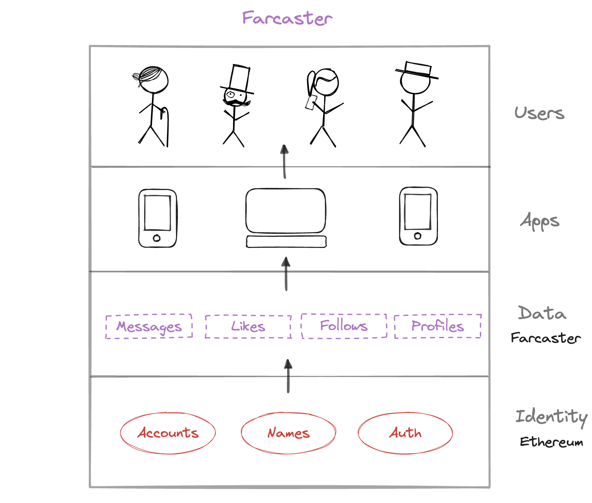

# What is Farcaster?

Farcaster is a protocol for building decentralized social apps.

It is a [sufficiently decentralized](https://www.varunsrinivasan.com/2022/01/11/sufficient-decentralization-for-social-networks) protocol where users control their data, and developers can build apps permissionlessly on the network. 

To learn more about Farcaster, check out the following resources:

- [Overview](./protocol/overview.md), to learn how Farcaster works.
- [Community](./intro/community.md), to get involved and find out where stuff happens.
- [App Directory](https://www.farcaster.xyz/apps), to find new apps and utilities.
- [Developer Portal](https://www.farcaster.xyz/devs), to find tutorials and other resources. 

Farcaster is still in beta, and an invitation is required to join. If you don't have an invite, you can join the [waitlist](https://app.deform.cc/form/5ccff9d9-9435-42da-bf0f-507e13cd0597/).

## FAQ

### Who is building Farcaster?

Farcaster is an MIT-licensed protocol created by a community of users and developers. The [Farcaster core team](https://github.com/orgs/farcasterxyz/teams/core/members) maintains the repository with contributions made by over 50 developers.

### Does Farcaster use a blockchain?

Farcaster uses Ethereum and Optimism Mainnet, an Ethereum L2, for its contract. Read the [architecture](./protocol/architecture.md) section to learn more.

### What does it cost to use Farcaster?

A Farcaster account requires a one-time fee for the gas to register the account onchain and an ongoing yearly fee to store messages. The one-time fee is about $0.20 at the time of writing, and the ongoing fee is about $5. Prices will change based on supply and demand. 

### Why is Farcaster invite only?

Farcaster is invite-only while we test and validate our contracts. We expect to drop this requirement by late 2023 or early 2024.