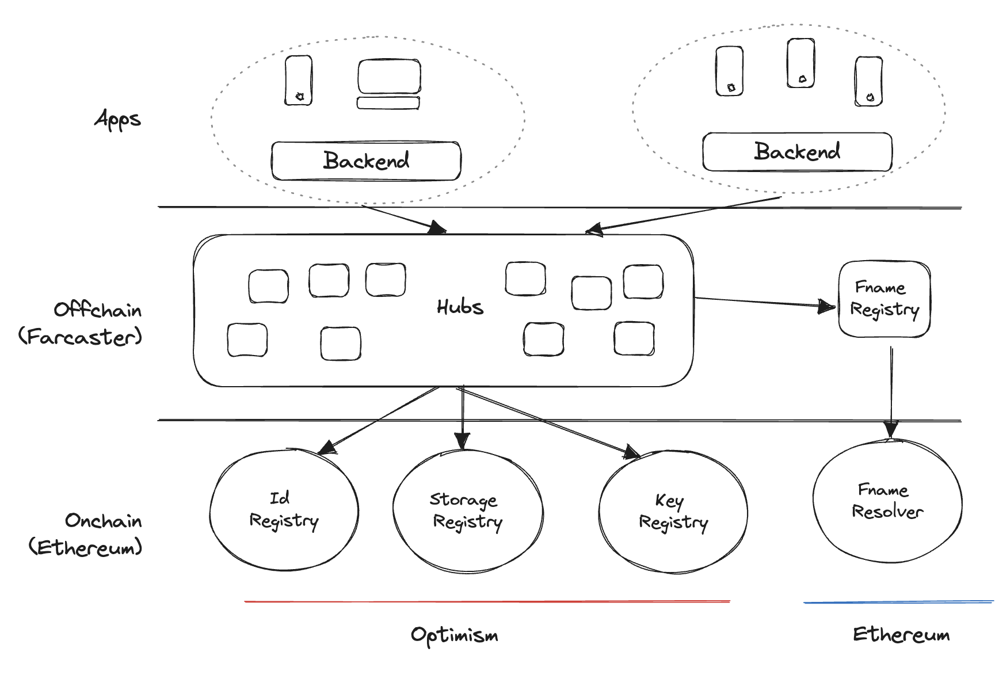

# Architecture 

A decentralized social network has many requirements that are difficult to meet in a single system. Users must be able to create, own, and transfer accounts in a decentralized manner. Messages they create must propagate in near real-time and are often issued at high volumes. Meeting these goals is only possible using a hybrid architecture that mixes onchain and offchain systems.

Onchain contracts are used for infrequent actions where consistency and decentralization are important. Accounts, usernames, storage, and keys are managed using a series of Ethereum contracts. 

Offchain systems are used for frequent actions where performance is critical. Messages created by user accounts are stored and propagated on a p2p network of Farcaster hubs. Unlike blockchains, the network uses an eventually consistent model which allows fast message propagation in exchange for a weaker consistency model. 

## Registry Contracts

Registry contracts on Optimism Mainnet manage account identities, signers, and storage. There are three primary contracts: 

- **Id Registry** - issues fids to create new accounts
- **Storage Registry** - tracks how much storage each account has
- **Key Registry** - lets accounts register message signers 

The contracts are designed to be simple, non-upgradeable, and have a limited lifespan. The contracts are deployed in a trusted mode where only Farcaster can register new accounts. After a testing period, they are made permissionless so that anyone can register an account. This change cannot be undone.

### Id Registry

A user can create an account by requesting a unique, numeric identifier called an fid from the IdRegistry. The Ethereum address to which the fid is issued is called the custody address. An address can hold one fid at a time but can transfer them freely. The IdRegistry also lets accounts specify a recovery address, which can transfer the fid at any time.

### Storage Registry

Accounts pay a fee to acquire storage from the Storage Registry. The contract manages storage prices and tracks how many units each account is owed. The price is denominated in USD but must be paid in ETH. A Chainlink oracle determines the exchange rate which is updated at most once in 24 hours.

The protocol defines a maximum number of available storage units, enforced by the contract. This ensures that the network does not grow so quickly that Hubs cannot add storage. Farcaster admins can set the exchange rate, price and modify the available storage units at any time.

### Key Registry

Accounts can register signers by publishing their public key on the Key Registry. Signers can be added or removed at any time, though they cannot be added back once removed. There is no restriction on adding the same signer to multiple accounts.

The signer must be an Ed25519 public key with a signature from the requestor, which is the account that requested the key. This can be the user's account or that of an app that wants to operate on the user's behalf. 

### Deployments

| Contract                  | Address                                                                                                                          |
| ------------------------- | -------------------------------------------------------------------------------------------------------------------------------- |
| IdRegistry                | [0x00000000fcaf86937e41ba038b4fa40baa4b780a](https://optimistic.etherscan.io/address/0x00000000fcaf86937e41ba038b4fa40baa4b780a) |
| StorageRegistry           | [0x00000000fcce7f938e7ae6d3c335bd6a1a7c593d](https://optimistic.etherscan.io/address/0x00000000fcce7f938e7ae6d3c335bd6a1a7c593d) |
| KeyRegistry               | [0x00000000fc9e66f1c6d86d750b4af47ff0cc343d](https://optimistic.etherscan.io/address/0x00000000fc9e66f1c6d86d750b4af47ff0cc343d) |

For more details and documentation, please see the [contracts repository](https://github.com/farcasterxyz/contracts/).

## Hubs 

A Hub is a server that validates, stores, and replicates messages to other hubs. It is conceptually similar to an Ethereum node, giving apps real-time access to read and write data. Unlike cryptocurrency nodes, hubs are eventually consistent and do not receive messages in order. This makes writing and reading messages very fast but adds more complexity when interpreting them. 

Hubs can run on laptops or commodity cloud hardware. They must store all valid messages created by users within their storage limits. It is a low-level, high-performance node with simple APIs. For most common use cases, app devs should proxy messages into a database for indexing and querying. 

### Validation

When a message is received, it is hashed, and its signature is compared against the Id Registry and Key Registry contracts. Messages also specify additional validation rules, which are checked by Hubs before they are merged. 

### Storage

The hub stores valid messages in a data structure called a message set. If adding a message to the set exceeds the storage limit, conflict resolution rules are applied. Typically, the earliest message ends up being discarded. The rules for resolution are designed so that messages added in any order will always produce the same set.

### Replication 

Messages added to a set are propagated to other hubs. A gossip network is established using libp2p and the message is broadcast to all peers. An out-of-band process called diff sync runs periodically to handle missed gossip messages. Each hub maintains a merkle trie of message ids and compares its trie to that of a random peer. Any unknown messages are fetched and merged into the hub's message sets.

Hubs monitor peers and score them based on their behavior. If a peer fails to accept valid messages, keeps falling behind or replicates messages too quickly, its score is lowered and it is ignored for exponentially longer periods by its peers.

### Implementations

- [Hubble](https://www.thehubble.xyz) - a Hub implementation in Typescript and Rust

## Usernames

Farcaster supports two kinds of ENS names:

- **fnames**, which are offchain, free, and governed by a usage policy.
- **.eth names**, which are onchain, decentralized, and cost money.

Fnames are operated by Farcaster while .eth names are operated by ENS. Other kinds of ENS names are not currently supported. Names can be up to 16 characters and only contain lowercase alphabets, numbers or hyphens. This prevents impersonation via homoglyph attacks and applies to fnames and .eth names. 

### Fnames

An fname is a username like `bob`, typically stylized as `@bob` when used in Farcaster apps. Its full form is `bob.fcast.id`, and it is implemented with an offchain ENS resolver according to [ENSIP-16](https://docs.ens.domains/ens-improvement-proposals/ensip-16-offchain-metadata).

Users can acquire an fname with a signed message from an fid that does not have one. A Fname Registry server accepts these signatures, issues new names, and keeps track of their owners. Responses from this server must be signed and can be verified onchain using the Fname Resolver contract.

### Fname Usage Policy

The usage policy is designed to prevent squatting and impersonation. The policy is manually enforced for now since it is not easy to automate and has two tenets:

- If you register an fname connected to a well-known public person or entity, your name may be deregistered. (e.g. @google)
- If don't actively use an fname for 60+ days, your name may be de-registered at our discretion.

Human intervention is often needed to resolve reasonable conflicts. For instance, you register @elon and Elon Musk signs up after you and wants the name. In such a case, we would ask three questions that guide the decision:

- Is the user active on Farcaster? (e.g. they've made several high quality posts in the last 60 days)
- Does the user have a reasonable claim to the name? (e.g. their name also Elon?)
- Does the user hold similar, active handles on other networks? (e.g. they own elon on twitter and elon.ens)

