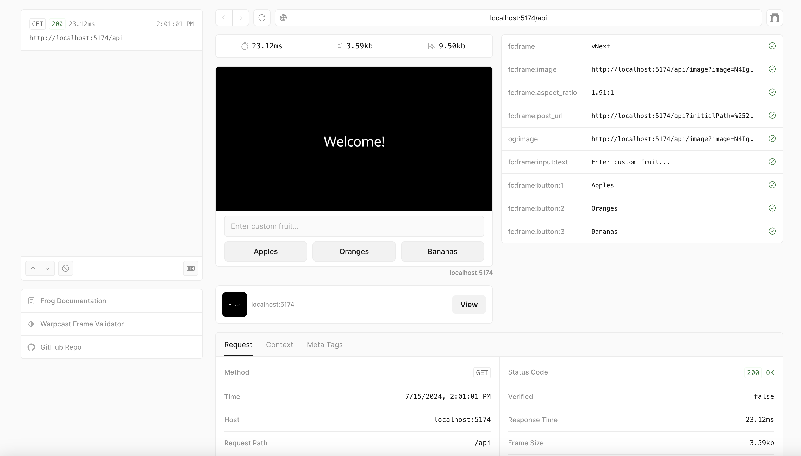

# 快速开始

::: info 暂未准备好构建？
如果您希望在构建前了解更多关于 Frames 的信息，请直接跳转至 [Frames 规范说明](./spec)。
:::

让我们使用 Frog 在一分钟内完成从零到一的搭建。最终您将获得：

- 一个包含基础 frame 的类型安全 frame 服务端
- 用于本地交互和调试 frame 的工具
- 部署在公共互联网上的服务

### 通过 CLI 快速初始化

通过以下命令创建新项目：

::: code-group

```ts [npm]
npm init frog -t vercel
```

```ts [yarn]
yarn create frog -t vercel
```

```ts [bun]
bunx create-frog -t vercel
```

```ts [pnpm]
pnpm create frog -t vercel
```

完成交互提示并按照指引操作：

```
bun install // 安装依赖
bun run dev // 启动开发服务器
```

::: info
本指南使用 Frog + Vercel 组合方案，但 frames 可以通过多种方式构建和部署。您可以在 [Frame 开发者资源](./resources) 页面查看流行替代方案如 [frame.js](https://framesjs.org/)。
:::

### 打开预览界面

当 frame 服务端运行后，访问 `http://localhost:5174/api/dev` 即可通过 [开发工具](https://frog.fm/concepts/devtools) 预览界面与您的 frame 交互。

您将看到一个显示 "Welcome!" 的 frame 和三个按钮：苹果、橙子、香蕉。点击任意按钮后，frame 将更新显示您选择的内容。



### 部署 frame

::: info
本项目初始化为 Vercel 部署方案，因其流行且操作简便。如需其他部署方式，请查阅 [Frog 平台文档](https://frog.fm/platforms/bun)。
:::

要发布您的 frame，需要将服务端部署到互联网上。此步骤可暂缓进行。

::: code-group

```ts [npm]
npm run deploy
```

```ts [yarn]
yarn run deploy
```

```ts [bun]
bunx run deploy
```

```ts [pnpm]
pnpm run deploy
```

完成交互提示后，您可以使用 [Warpcast Frame 验证工具](https://warpcast.com/~/developers/frames-legacy) 进行端到端测试。

::: info
请确保输入完整的 frame URL。对于 Vercel 项目，默认 frame 地址为 `https://<domain>/api`。
:::

## 后续步骤

完成首个 Frames 项目的初始化和部署后，建议：

- 阅读 [Frog 概念文档](https://frog.fm/concepts/overview) 学习如何构建复杂的 [多步骤 frame](https://frog.fm/concepts/routing)
- 尝试 [使用 frames.js 初始化项目](https://framesjs.org/guides/create-frame) 并查阅其丰富的 [指南](https://framesjs.org/guides/create-frame) 和 [示例](https://framesjs.org/examples/basic)
- 探索更多 [构建和学习 frame 的资源](./resources)
- 阅读我们关于打造优秀 Frame 体验的 [最佳实践](./best-practices)
